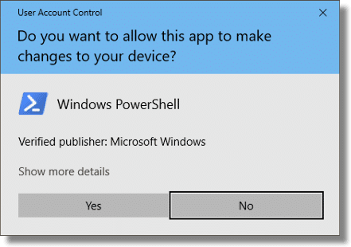

# sudo
A lightweight and single binary sudo for Windows OS

## How to use
```shell script
sudo <command-line>
```

## Example
```shell script ls
sudo powershell
```

Then this prompt shows to you.


